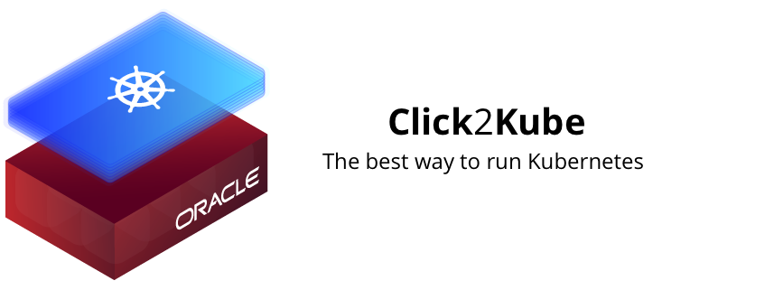

# Click2Kube

Click2Kube is your own Kubernetes cluster running on high-performance dedicated Oracle Cloud Infrastructure, launched from a single click by Wercker. It is an initiative created by Wercker for CoreOS fest San Francisco 2017, where access codes will be distributed.

## Table of Contents

* [Overview](#overview)
    * [How does it work?](#how-does-it-work)
    * [What do clusters ship with?](#what-do-clusters-ship-with)
* [Tutorials](#tutorials)
    * [Deploying an application from the command line](#command-line-hello-world)
    * [Deploying an application with Wercker: Hello, Wercker!](#wercker-hello-world)
    * [An introduction to Stern](#an-introduction-to-stern)
    * [Installing Prometheus](#installing-prometheus)
* [Support](#support)


## Overview

### How does it work?


1. You receive a code from Wercker in an email
2. You enter the code on our Click2Kube landing page, which makes a call to the Click2Kube API via the Wercker API
3. This call then triggers a Click2Kube Wercker pipeline run that configures and runs Terraform inside of Oracle Cloud.
4. This Wercker pipeline sends status updates back to the Click2Kube service as the cluster launch progresses to keep you up to date with what's happening
5. Once the cluster is provisioned, the Click2Kube service sends OCI cluster connection details which are displayed on the Click2Kube landing page!

You'll always be able to get back to the cluster status page containing the connection details by entering your code on the landing page.

### What do clusters ship with?

We pre-install some services on to all new clusters to give you a head start in working with them:

- [An Nginx-based Ingress controller](https://kubernetes.io/docs/concepts/services-networking/ingress/#ingress-controllers)
- [Butterfly Console](https://github.com/paradoxxxzero/butterfly)

## Tutorials

### Command Line: Hello, World!

#### Ingress

We've created a simple Hello World application to deploy to your Click2Kube cluster. Deploying this is a simple case of:

1. Get your cluster's load balancer address which is exposed on the cluster status page as a sub domain of your cluster's domain. For example:


2. Since the cluster's domain is `bf4c05325.obmc.wercker.com`, the LB ip can be found via:

```
-> % dig lb.bf4c05325.obmc.wercker.com +short
129.146.10.47
```

You can either use this IP directly or create a CNAME DNS entry in your own DNS provider to point your domains to the load balancer domain.

#### Deploying your first application

1. As you can see, in this case your cluster's externally accessible Load Balancer IP is `129.146.10.47`

2. The application can be deployed with:

```
kubectl apply -f https://raw.githubusercontent.com/wercker/click2kube-docs/master/hello-world.k8s.yml
```

3. Once deployed, you should be able to access the application at your load balancer address, in this case `129.146.10.47`:

```
-> % curl 129.146.10.47 -H "Host: hello-world.example.domain"
Hello, World!%
```

### Wercker: Hello, World!

This quick tutorial will guide you through the process of taking our Hello World application from source code to production on your Click2Kube cluster using Wercker.

#### Ingress

1. Get your cluster's load balancer IP address which is exposed as a sub domain of your cluster's domain. For example:


2. Since the cluster's domain is `bf4c05325.obmc.wercker.com`, the LB ip can be found via:

```
-> % dig lb.bf4c05325.obmc.wercker.com +short
129.146.10.47
```

#### Preparation

You will need write access to a Docker registry of your choice. We used [Quay.io](https://quay.io/) in this demo.

1. First, fork the [Hello World application](https://github.com/wercker/hello-world) Git repository in to your own GitHub account.
2. Create a Wercker account: https://app.wercker.com/users/new?return_url=%2F
3. Select "Create" -> "Application" from the menu and step through the process of linking your GitHub fork to your Wercker account.

You should then land on your new application's page:


#### Pipelines

The demo application repository already contains a wercker.yml, which is split in to the following pipelines:

1. build: The pipeline that includes steps for installing application dependencies inside of your Wercker run container, before creating a Hello World application binary.
2. push-quay: The pipeline that takes the output of the `build` pipeline, i.e your binary artifact, builds it in to a Docker image, then pushes that image to a Docker registry.
3. deploy-to-kubernetes: This pipeline prepares your application's Kubernetes configuration for the current revision of your application by adding the git commit and Docker registry information provided by [Wercker Environment Variables](http://devcenter.wercker.com/docs/environment-variables), before connecting to your Click2Kube cluster and instructing it to create a Kubernetes Service, Deployment, and Ingress.

#### Workflows

In order to get an automated end-to-end flow of these pipelines, we need to chain them together in to a Workflow:

1. Go to the Workflows tab
2. Select "Add a new pipeline"
3. Create pipelines for push-quay, and deploy-to-kubernetes.
4. Chain them together via the Workflows editor as: build -> push-quay -> deploy-to-kubernetes


#### Environment Variables

Next we need to define the environment variables on Wercker Web that we reference in the wercker.yml. These variables reference secrets and values that don't make sense to hold in our git repository. The screen shot of our wercker.yml below shows custom environment variables highlighted in red, and standard Wercker environment variables available in all runs in green. [The Wercker documentation explains these environment variables in more detail.](http://devcenter.wercker.com/docs/environment-variables)


In order to add the values for these variables we need to define them by selecting the "Environment" tab on your Wercker application, then adding the following:

| Name              | Value                                                                                                                    |
|-------------------|--------------------------------------------------------------------------------------------------------------------------|
| DOCKER_REPO       | A Docker registry repository you have write access to. We used Quay.io.                                                  |
| DOCKER_USERNAME   | Your Docker registry username                                                                                            |
| DOCKER_PASSWORD   | Your Docker registry password                                                                                            |
| KUBERNETES_MASTER | Your Kubernetes API server address from the Click2Kube details page, e.g `https://k8s-master.bf4c05325.obmc.wercker.com` |
| KUBERNETES_TOKEN  | Your Kubernetes access token, taken from the Click2Kube details page. e.g `w3vcae5v0bl3lsu2dvd7qutb790x683g`             |

Select the "protected" tick box next to any value if you wish to keep them hidden from the web UI.

Your environment variables tab should look something like this when finished:


#### Your first run

Now that we've defined the environment variables required, and configured Wercker to run the pipelines defined in wercker.yml, we can instruct Wercker to carry out our first run of our end-to-end pipeline!

This can be done by going back to the `runs` tab, and selecting `Trigger a build now`, which will start a chain of Wercker pipeline runs, as defined on the Workflows tab:

1. A run will begin that will download your application dependencies, then build the Go binary
2. If successful, a new run will begin which will create a Docker image from the new binary, then push it to your Docker registry
3. Once this completes, a third and final run will begin that will run the [Kubectl Step](https://github.com/wercker/step-kubectl) to interact with your Click2Kube cluster, and instruct it to launch an application using the kubernetes.yml file in your application Git repository!

If all three pipelines are successful you can check the status of your new deployment on your Click2Kube cluster with:

```
kubectl get pods
```

If you see a pod starting with "Hello-World" with a status of "Running", you've successfully deployed to your Click2Kube cluster!

A quick Curl request to your application (which should be listening publicly via a pre-installed Nginx Ingress controller), on the domain [hello-world.example.domain](https://github.com/wercker/hello-world/blob/master/kubernetes.yml.template#L49) should show you

```
-> % curl 129.146.10.47 -H "Host: hello-world.example.domain"
Hello, World!%
```

(Replace  `129.146.10.47` with the IP address of your Load Balancer, found by following the steps from the "Ingress" section of this document)

Success!

### An introduction to Stern

Once you've got some applications running on your Click2Kube cluster, you'll likely want to view the logs from pods. One of the limitations of using the `kubectl` command for this is that you can only view the logs of one pod at a time, which isn't ideal for applications that span across multiple pods.

To solve this, We released a tool called [Stern](https://github.com/wercker/stern) which allows you to tail multiple pods on Kubernetes and multiple containers within the pod. Each result is color coded for quicker debugging.


[Read more about Stern in our guest post on the Kubernetes Blog...](http://blog.kubernetes.io/2016/10/tail-kubernetes-with-stern.html)

### Installing Prometheus

Prometheus is a popular monitoring tool that can be used to keep an eye on your cluster and the services that run on it. CoreOS recently released [Operators](https://coreos.com/blog/introducing-operators.html), including a Prometheus Operator that allows you to install Prometheus in a few steps. [Follow their tutorial here to install Prometheus](https://coreos.com/blog/the-prometheus-operator.html) on to your Click2Kube cluster.

## Support

If you have any questions that aren't covered in this document or are running in to issues that require assistance, please [open a support ticket](http://bit.ly/2oSljpf) or tweet [@wercker](https://twitter.com/wercker). One of our Solutions Architects or Engineers will be in touch as soon as possible!